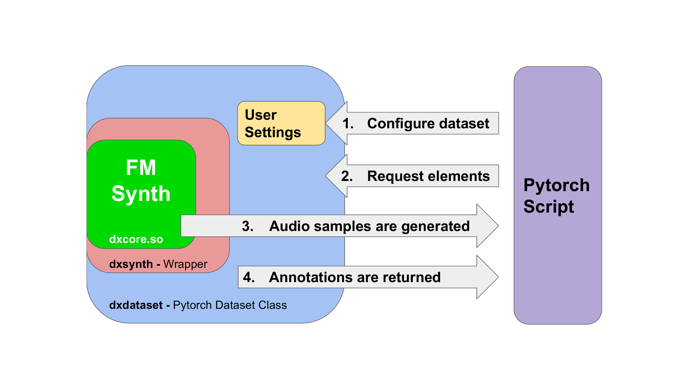

# dx7pytorch

A Pytorch FM Synthesizer for audio deep learning.

## Intent

Music instrument datasets are scarce and usually very large, composed by thousands of very small files, being difficult to handle and of limited versatility. 
**dx7pytorch** addresses this problem by bundling an <a href="https://en.wikipedia.org/wiki/Frequency_modulation_synthesis" target="_blank"> FM Synthesizer</a> core into a Pytorch dataset wrapper. 

The synthesizer core is a C++ emulator of the famous <a href="http://www.vintagesynth.com/yamaha/dx7.php" target="_blank">Yamaha DX7</a>, a programmable digital instrument for which
rich and varied timbres can be created by manipulating its internal parameters. Each combination of parameters is called **patch** and describes a particular timbre. 

The timbres described by the patches can be synthesized into sound samples at any **note** or **velocity**. Hence, the dataset only requires to store patch information, 
occupying only a couple of Megabytes.

There exist thousands of patches for this instrument. This dataset includes a collection of 29830 unique patches extracted from a public source and filtered by a CRC32 hash filter. 
See next sections to know how to replicate the filtering process and compile your own DX7 patch dataset.

## Features

- On-the-fly audio synthesis with full MIDI **note** and **velocity** support.
- Selectable **sampling frequency**.
- Arbitrary **instance lenght**.
- Annotations are automatically generated (fundamental frequency, velocity, patch vector).

## How do I use it?

**dx7pytorch** in 4 simple steps!



1. In your Pytorch script, create an instance of the **dx7pytorch** dataset class, specifying:
    * Path to the patch collection.
    * MIDI note and velocity range to synthesize.
    * Sampling frequency and Instance length.
    * The use of a patch filter if desired.
1. Use the dataset interface or a Pytorch *dataloader* to request audio instances.
    * A specific MIDI note and velocity within the specified range is sent to the synthesizer.
1. The audio samples are generated on-the-fly, every time a request is received.
1. The Pytorch wrapper can additionally deliver MIDI annotation or patch information.

## Try it!

1. Install this Python package: 
    ```bash
    pip install git+https://github.com/fcaspe/dx7pytorch
    ```
1. Or manually install and test it
    ```bash
    git clone https://github.com/fcaspe/dx7pytorch
    cd dx7pytorch
    python setup.py install
    cd tests
    python test_pytorch.py 
    ```


## Compile your own patch collection

This dataset contains a subset of unique patches extracted from <a href="http://bobbyblues.recup.ch/yamaha_dx7/dx7_patches.html" target="_blank">Bobby Blues</a> webpage.

* You can regenerate the included dataset by entering to the **dataset** directory and trying:
    ```
    source generate_dataset.sh
    ```
    The script will download the original patch collection, move all files to a single directory and run the **patch_packer.py** script which will scan for uniqueness and
    compile the filtered patches onto a **collection.bin** file which can be used by **dx7pytorch**. From the 140192 patches downloaded, only 29830 are unique.

    *Note: Processing all patches takes a while; 1h 30min on my computer.*
     
     
* To compile your own patch collection, extracted from Yamaha DX7 sysex files, put all your patch files into an empty directory, and run:
    ```
    python3 patch_packer.sh /path/to/patch/dir/
    ```
    The packer will scan for uniqueness and generate a **collection.bin** file.

## Acknowledgements
- The synthesizer core of **dx7pytorch** is based on the <a href="https://github.com/smbolton/hexter" target="_blank">Hexter</a> DX7 emulator. Licensed under GPL-2.0
- DX7 Patch collection extracted from <a href="http://bobbyblues.recup.ch/yamaha_dx7/dx7_patches.html" target="_blank">Bobby Blues</a> webpage. Released under public domain.
